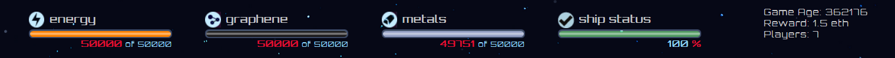
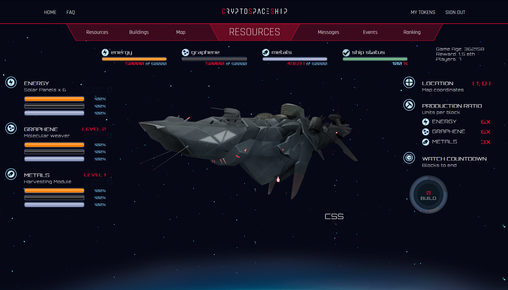
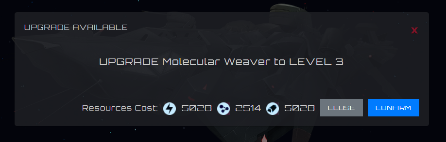
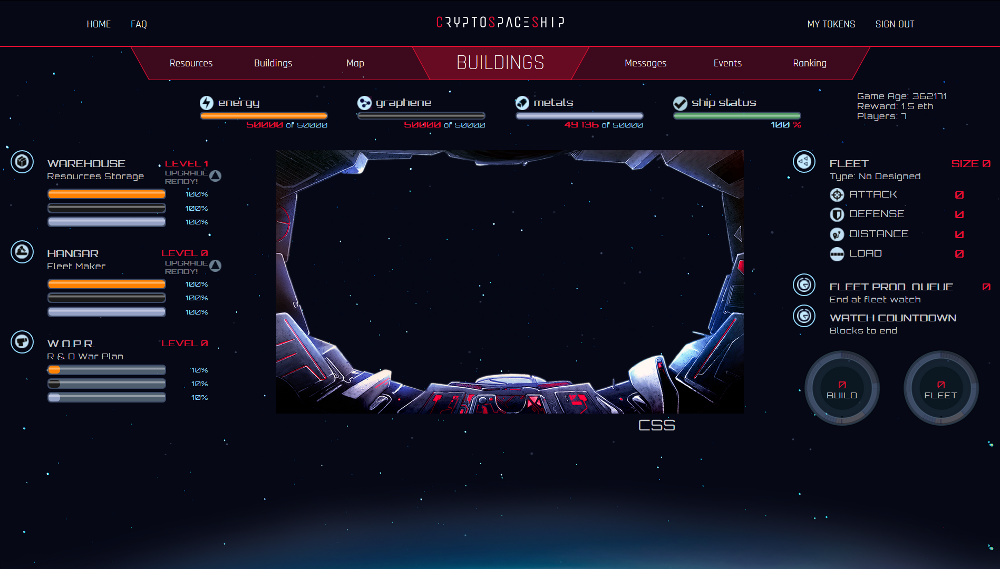
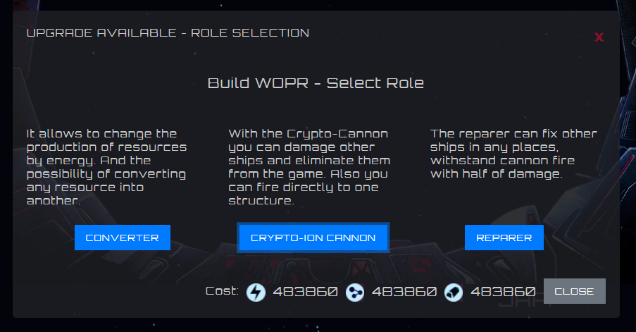
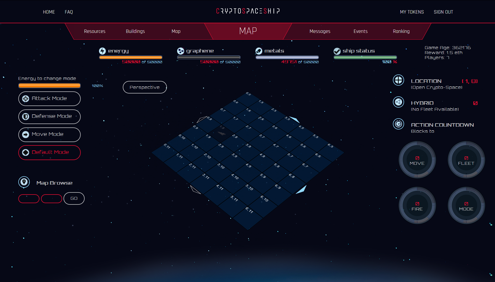
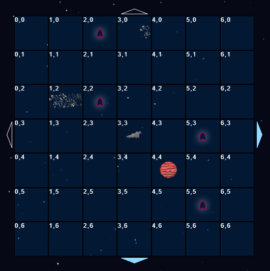
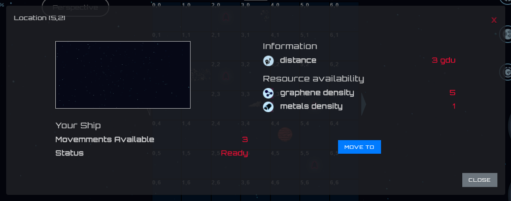
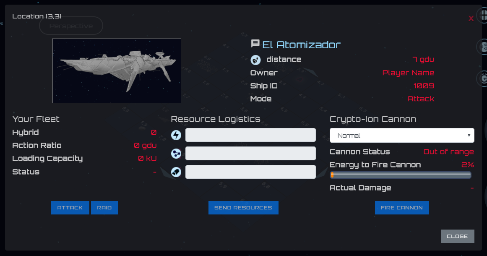
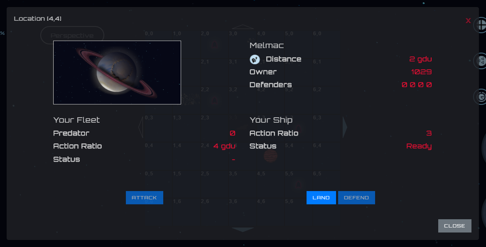

###############
Command Center
###############

Every Crypto-space Shiphas to know how to evolve it, win battles and cross the crypto-space.

*********************
 General Indicators
*********************

The following indicators are always present and report the following:

1. Acumulated **Energy** ammount over the current storage capacity. ( **storage** over **capacity** )

2. Acumulated **Graphene** ammount over the current storage capacity.

3.Acumulated **Metals** ammount over the current storage capacity.

4. Crypto-space Ship status. **100%** show that is on optimal conditions.

.. hint::
    When the acumulated resource are equal to the current Crypto-space ship storage capacity and production of each resourse is greater than 0, resources are being wasted. **You shoud spend your resources or if possible, increase the capacity on the wharehouse**.

*********
Resources
*********

Bellow is the resources view.

Left section
============

Its possible to see the level of:

1. Solar Panels

2. Graphene Collector

3. Metals Collector

The bars indicate available resources amount to upgrade in the next level. Yellow color represent energy, black graphene and grey metals.

The blinking **UPGRADE READY** boton, shows that enough resource for upgrade are available and there is nothing being build, since simultaneus upgrades are not allowed. When pressed, its possible to watch resources amount needed for the upgradeand clicking on **Confirm** buton, the construction orden is being sent.

Once confirmed, resources are debited and the upgrade begin.

Right Section
==============

Here it shows:

1. **Location**: Coordinate where the Crypto-space Ship is located.

2. **Production Ratio**: Resources production per block.

3. **Watch countdown**: The countdown that shows how many blocks left to finish the upgrade.

Optionally other butons can show unblocking some features, such as the option to turn on the resource converter and the option to convert resources.

.. note::
    **The unit measure time is in blocks**

*************
Constructions
*************

Internal construction panel view

Left Section
============

Just as the resources view, the following structures are shown

1. Wharehouse

2. Hangar

3. W.O.P.R

The bars shows the available resources quanities available for upgrade to next level. Yellow color represent energy, black the graphene and grey for metals.

The blinking **UPGRADE READY** buton, shows that enough resources needed to upgrade level are meet and there is nothing being built, since simultaneus upgrade are no allowd. By pressing the buton, its possible to see the resource quantitty needed in order to upgrade and by clicking on the **Confirm** buton, the construction order is sent.

When upgrading the W.O.P.R from level 0 to level 1, you must select the W.O.P.R role betwen:

1. Converter

2. Crypto-Ion Cannon

3. Reparer

Right Section
===============

In this section you can find information about the configuration of your combat drones fleet (**fleet**).

1. **Fleet**: Information about drones fleet

    - Number of drones on the fleet
    
    - Features of the fleet, meaning, atacks points, defense, distance and load. In the case the fleet is designed. When building the hangar at level 1, the blinking buton **DESIGN FLEET** is shown and then, after desinged **BUILD MORE**.

    - LThe other option that activates under that circunstance is the  **DISASSEMBLE FLEET** blinking buton in order to destroy the current fleet.

2. **Fleet Prod. Queue**: The number of drones that are in the construction queue.

4. **Watch countdown**: Watch coundown.

    - **BUILD**: The number of blocks left to finish the upgrade of the wharehouse, hangar or wopr.

    - **FLEET**: The number of blocks left to finish the upgrade of the construction drones fleet.

***
Map
***

The strategic section for excellence, where the great commanders are forged and the legends are born.

Left Section
============
  
In this part you can find the bar that indicates the energy needed to change the Crypto-space Ship mode.
Then the different buttons to change mode. Indicating with a different color the current mode.

Finally we can put some coordinates in **Map Browse** in order to explore a position on the map.

Central Section
===============

In this section we find the strategic map of 7x7 boxes each one represented by a coordinate. In the center, if possible, is the Crypto-space ship that we are commanding.
We can also identify other objects such as:

- **Planets**

- **Asteroides belt**

- **Other Crypto-space ships**

- **Coordenadas vacias**

Empty Coordenates
-----------------

When inspecting an empty position, we can see information about it. The density of resources, both graphene and metals; as well as the distance to which it is.
If the **Mode To** option is enabled, we can move the Crypto-space Ship to that position.

.. hint::
 The resources availability varies in different positions, it is convenient to search for a place with a high density of resources. A high density implies greater production, a faster evolution makes the Crypto-space Ship more powerful in less time.

Other Crypto-space Ships
------------------------

When you select another Crypto-space Ship, you can see information about it.

- **Name**: Represent the other ship name, you can send messages to the captain of that ship just by clicking over the name.

- **Distance**: The distance between the two Crypto-space ship measure in **gdu**

- **Mode**:The mode the ship is. This information is very useful if you want to attack it.

In order to atack the selected ship, first certain conditions must be meet

1. To have a **Drones fleet**

2. The fleet must be ready for action. if the fleet have been recently in action, you must wait the left blocks for repairment and supply.

3. The other Crypto-space Ship must be at range distance as the fleet designe.

When the conditions described above are met, the **Attack** and **Raid** buttons are enabled. Both actions perform a bellicose action on the other Crypto-space Ship but with the difference that **Attack** tries to destroy all the ships and then steal resources, instead **Raid** tries to steal resources trying to save as much drones as possible.

**Send resources** allows you to send resources to the other Crypto-space Ship, you have to meet the same requirements to start a battle. The amount that can be sent depends on the design of the drones and the amount that the fleet conforms to.

.. note::
The number of blocks needed to replenish the drones is much greater when attacking than when sending resources to other Crypto-space Ships.

According to the selected role when expanding the **W.O.P.R** you can enable the option to fire the Crypto-Ion cannon or repair the Crypto-space Ship, if you have selected **Crypto-Ion Cannon** or **Reparer**

When firing the Crypto-Ion cannon, you can choose between two shooting modes:

- **Normal**: Causing damage to the entire Crypto-space Ship.

- **Accuracy**: Causing damage only to the selected structure, destroying the levels corresponding to the update level of the Crypto-Ion Cannon.

Planetas
--------

Cuanto se selecciona un planeta se disponibilizara la informacion del mismo.

- El nombre con que se conoce al planeta

- La distancia a la que se encuentra

- El dueño del planeta

- Las Cryto-space Ships que se encuentran defendiendolo

.. note::
    Los planetas son defendidos por nativos antes de la primer conquista. Nunca se debe subertimar el poder de estos.

El boton **Attack** estara disponible en caso de que la flota de drones este lista para el combate, el planeta se puede atacar para intentar debilitar a los defensores o directamente intentar la conquista.

Si la intencion es defender el planeta, se puede ocupar una de las 4 posiciones defensivas, es necesario contar con drones para que **Defend** esta habilitado.

Para poder aterrizar basta con presionar el boton **Land** que se disponibilizara en caso de que la Crypto-space Ship esta a distancia y los motores esten listos para el siguiente movimiento.

.. hint::
    Al aterrizar en un planeta **la produccion de grafeno y metales es nula**, pero es una excelente opcion para escapar de un enemigo. Al aterrizar en un planeta no hay forma de ser atacado.

Sección Derecha
===============

- **Location** nos indica las coordenadas de la posicion de la Crypto-space Ship en el mapa

- **Hybrid**, **Predator**, **Keeper**, **Galleon** o **Interceptor** indica el tipo de drones de combate que tenemos y la cantidad disponible de los mismos. Debajo en que estado se encuentran: **Ready for battle** o **Waiting**. 

- **Action Countdown** la cantidad de bloques necesarios para

    - **Move**: realizar un movimiento de la Crypto-space Ship. Esto se debe a que los motores se deben cargar para poder realizar el proximo salto.

    - **Mode**: poder cambiar de modo nuevamente.

    - **Fleet**: para poder utilizar nuestra flota nuevamente, ya sea para enviar recursos o para atacar una Crypto-space Ship enemiga. Hay que considerar que luego de un ataque o de un viaje, los drones necesitan reparaciones y recarga de energia.

    - **Fire** o **Repare**: La espera para poder realizar otra reparacion o dispario de cañon. Este contador depende del rol elegido al momento de actualizar el WOPR a nivel 1.

********
Mensajes
********

Es la manera que tienen las Crypto-space Ship para comunicarse entre si. Al instante de escribir un mensaje el capitan de la otra Crypto-space Ship ya puede leerlo.
Solamente es necesario saber el nombre de la otra Crypto-space Ship a la hora de redactar el mensaje.

*******
Eventos
*******

