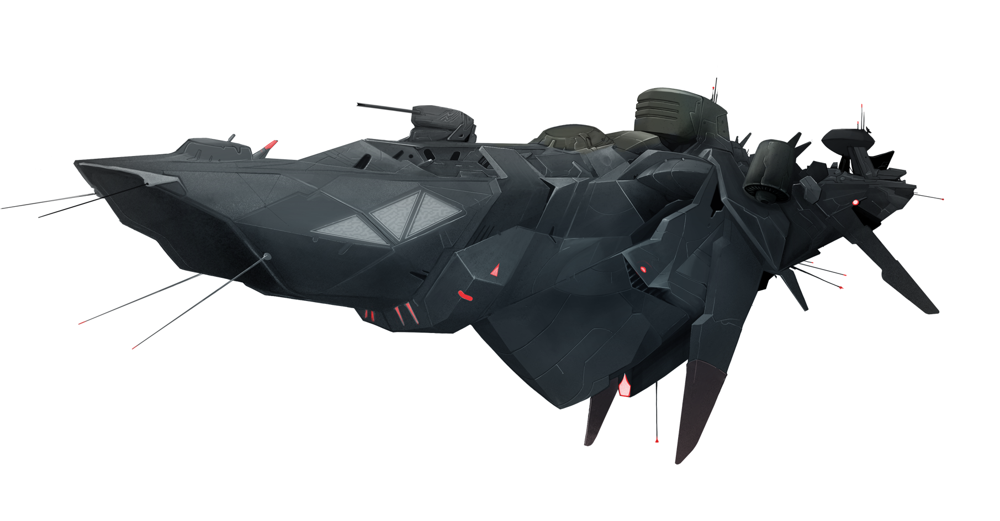
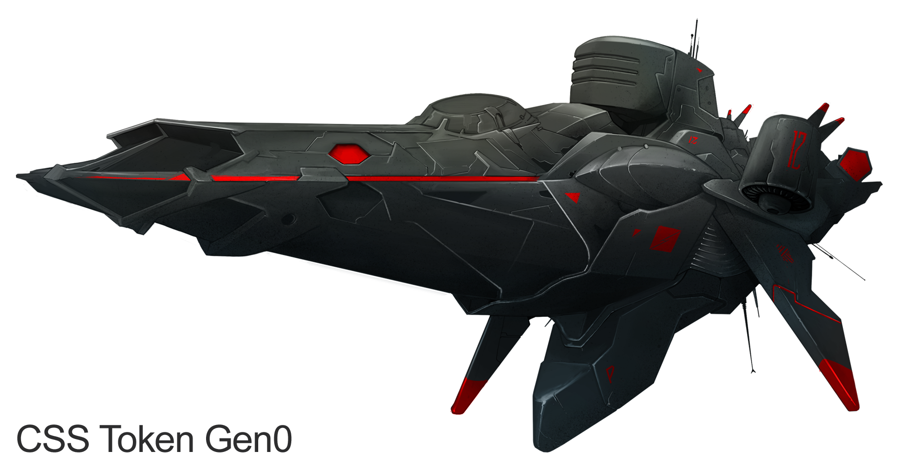
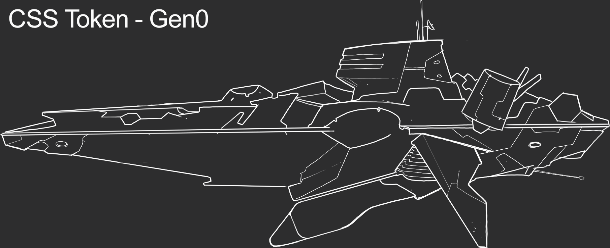
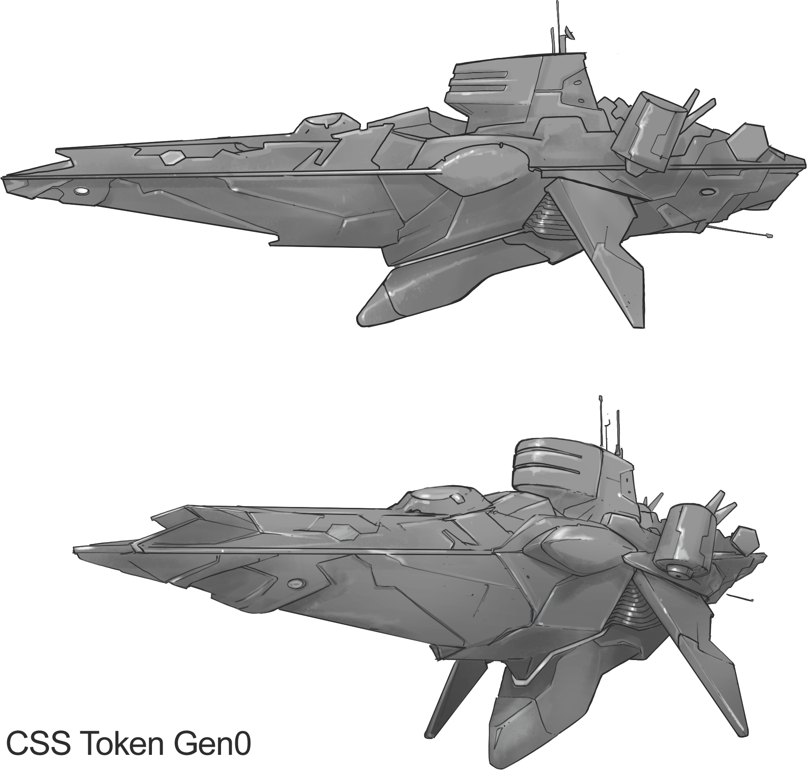
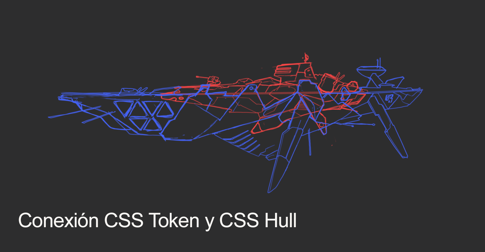
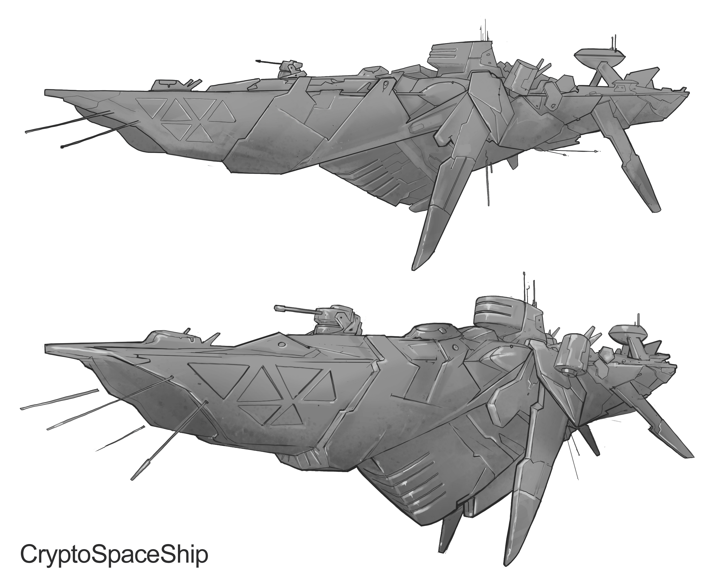

#################
Crypto-space Ship
#################

The Crypto-space Ships are powerful self-sufficient stronghold that can ride through space and impose respect in their path. It is composed of the command module and the helmet, **CSS Token** and **CSS Hull** respectively

*********
CSS Token
*********

Description 
===========

CSS Token are the command modules for the CryptoSpaceShip ships. These command modules have skill processors called
**QAIM** (Quantum Artificial Intelligence Module). As a CSS Token participates in different war scenarios, his QAIM processors are trained, which improves performance and abilities in the next missions and operational fields.

Each CSS Token has particular characteristics of the generation and general characteristics. Regardless of the generation, you can differentiate one by:

- First name
- Colour
- Generation
- NFT #id

.. note::
    The current generation of the Token CSS is: **Gen 0**

Characteristics of the current generation
=========================================

- Generation: Gen 0

- Crew: 600

- Initial level: 0

- Training Limit: 1000 points

- Training capacity: 5 points per level

- QAIMs: 6

::

    QAIMs
    1. Fleet Points
    2. Resources Improvement
    3. Constructions Improvement
    4. Fleet improvement
    5. Jumping GDU Improvements
    6. Mode Change Improvements

.. note::
    The **Training Limit** establishes the number of points necessary to be able to level up, you get point while playing and when you upgrade level, you are able to better **Training Capacity**, in **Gen 0** you need 5 point to train your QAIM
   

.. hint::
    Once the QAIM points are distributed there is no way to go back. Think carefully about your choices for the imprint you want for your CSS Token.
    
    

********
CSS Hull
********

Description
===========

The CSS Hull is the component that together with the CSS Token form a Crypto-space Ship. This disposable module is only used for an operations field, giving possibility to the CSS Token to venture into the crypto-space converting it into a real mothership and agile stronghold.
All the Hull CSS at the moment of connecting have all their structures in a basic level that must progress from level to become more powerful.

.. note::
    The current generation of CSS Hull is: **Gen 0**

Characteristics of the current generation
=========================================

- It has two CryIon-2 engines that allow a jump of up to 6 gdu

- Storage of resources

- Space for up to 520 combat drones

- 2 QAIM connectors

- 4 Behavior modes: Attack, Defense, Movement and Normal

.. note::
    The generation **Gen 0** has a 2 QAIM interface with the CSS Token module. That is to say if the CSS Token has more QAIMs, as maximum they will be able to connect with two of them.
    

Productive Structures
=====================

In **Crypto-Space** there are 3 elements: Energy, Graphene and Metals. All the updates in the Crypto-space Ship require a certain amount of resources for its construction.

Below are the production structures

- **6 Solar panels**: Solar panels absorb enegy from the nearest star. Each of the solar panels can be upgraded from level 1 to level 10

- **1 Graphene collector**: As the name says, this module collects and processes the graphene that is scattered in the crypto-space. The graphene collector can be updated from level 1 to level 10. Producing graphene 1 (one) per density on the first level and 40 (forty) graphene per density on the highest level.

- **1 Mineral Collector**: This module collects the metals that exist in each quadrant. It can be updated from level 1 to level 10. Producing in the first level 1 (one) metals per density and in the last level 40 (forty) metals per density.

.. hint::
    Developing these productive structures first can give you the advantage since an economically developed ship is a powerful ship.

.. note::
    The production of energy does not depend on the position where the Crypto-space Ship is located since it does not depend on the distance to the nearest star. In the case of graphene and metals, each coordinate of the crypto-space has a different density.
    Currently the variation of the density of the different elements is a subject of study.

Below is the production calculation.

::

    pe = d * N
    Being
        pe = Production
        d = Density of the resource in the position
        N = The ammount produced by a colector on a given level

Internal structures
===================

- **Warehouse**: 4 levels with different storage capacity in each upgrade

- **Hangar**: 4 levels. Each level adds a greater number of fleet points and the amount of resources that are available at the time of assembling the fleet of combat drones.

- **W.O.P.R**: The wopr is the construction space in the CSS Hull that allows you to choose between the following devices

    1. **Crypto-Ion Cannon**: Cannon that allows two shot modes, normal and aiming. The normal mode attacks the entire CryptoSpaceShip raising the general damage, which causes a proportional decrease of the production and of the construction and preparation times for the general actions of the CryptoSpaceShip (movements, mode change, shots). The aiming mode allows aiming and damaging a particular structure and generates damage.

    2. **Repair**: Special module that allows repair and repair to other CryptoSpaceShip of damage caused by cannon fire. It also has a shield that attenuates the damage of the shots.

    3. **Resource Converter**: This module allows to convert in real time the production of graphene and metals in energy production, is also able to convert any resource into another.

Ship modes
==========

The current generation of CSS Hull has 4 modes, one with its respective penalties and bonuses with the exception of normal mode.

Atack Mode
----------

+-----------------------------------+-------------------------------------------------------+
| Bonus / Penalization              | Description                                           |
+===================================+=======================================================+
| +25%                              | Attack power for the Drones fleet                     |
+-----------------------------------+-------------------------------------------------------+
| +50%                              | Attack range for the Drones fleet                     |
+-----------------------------------+-------------------------------------------------------+
| -5%                               | Defense power for the Drones Fleet                    |
+-----------------------------------+-------------------------------------------------------+
| -25%                              | Motion range for the CryptoSpaceShip                  |
+-----------------------------------+-------------------------------------------------------+

Defense Mode
------------

+-----------------------------------+-------------------------------------------------------+
| Bonus / Penalization              | Description                                           |
+===================================+=======================================================+
| +30%                              | Defense power for the Drones Fleet                    |
+-----------------------------------+-------------------------------------------------------+
| -10%                              | Attack range for the Drones fleet                     |
+-----------------------------------+-------------------------------------------------------+
| -100%                             | Rango de movimiento de la CryptoSpaceShip             |
+-----------------------------------+-------------------------------------------------------+

Movement Mode
-------------

+-----------------------------------+-------------------------------------------------------+
| Bonus / Penalization              | Description                                           |
+===================================+=======================================================+
| +50%                              | Motion range for the CryptoSpaceShip                  |
+-----------------------------------+-------------------------------------------------------+
| -10%                              | Attack range for the Drones fleet                     |
+-----------------------------------+-------------------------------------------------------+
| -10%                              | Defense power for the Drones Fleet                    |
+-----------------------------------+-------------------------------------------------------+

Drones fleet
------------

Each active drone consumes 1x of energy decreasing the production, as a result you can have as many active drones according to the amount of energy produced by the CryptoSpaceShip.
The design of the drones consists in the distribution of the available points according to the hangar level. 

.. hint::
  	Drones can be designed and redesigned at any time, the only requirement is to have no active drone. You can also destroy the active drones in order to redesign. From hangar level 2, when destroying active drones part of the resources are recycled and returned to stock.

The points for the design of drones can be distributed in the following characteristics:

    1. **Attack**: Attack points for each drone
    2. **Defense**: Defense points for each drone
    3. **Load**: Load capacity for each resource
    4. **Distance**: Range of attack

According to the distribution of the points there are 5 different types of drones

    - **Predator**: Its main feature is the attack
    - **Keeper**: Its main feature is the defense
    - **Interceptor**: Its biggest feature is the range of attack
    - **Galleon**: Its biggest feature is the amount of resources it can carry
    - **Hybrid**: Does not have an outstanding feature		

.. note::
    Two or more types of drones can not coexist at the same time. If the strategy changes, it is necessary to destroy current fleet, redesign and build new types of drones.

.. hint::
    Drones not only serve for war, but also to send resources to an allied ship, it is necessary that drones have **distance** and **cargo** points.

   

